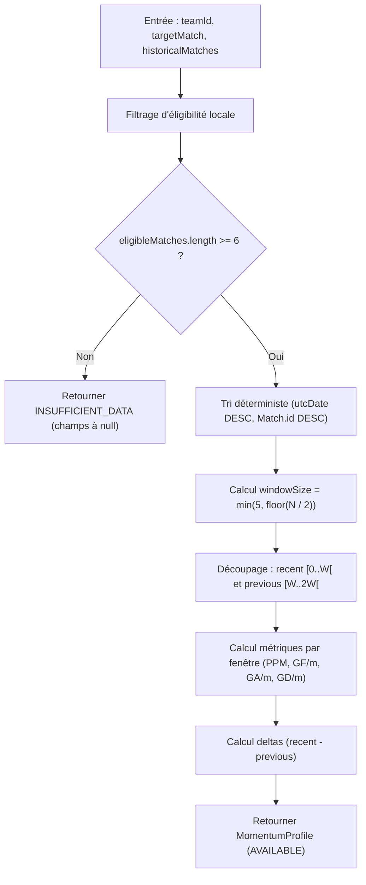

# Phase 3.6 — Conception technique « Momentum descriptif / Dynamique récente » (DEC-033)

Date : 2026-08-20
Responsable : Fondateur ABYSS
Statut : APPROUVÉE
Prédécesseurs : DEC-032 (Cadrage Phase 3.6), Gate A (Audit de faisabilité technique — CONFORME)
Base Git : `c67a164b470c2656eaa492579266663b1a905fb5`

---

## 1. Contexte & Alignement avec DEC-032

La présente décision technique formalise et verrouille l'architecture logicielle, les contrats d'interface, les algorithmes et le plan de tests pour la brique **Momentum descriptif** (intitulée **« Dynamique récente »** en interface), conformément aux arbitrages validés dans DEC-032 et validés techniquement lors du Gate A.

### Principes et Garanties
- **Strictement descriptif, déterministe et explicable** : zéro score composite (`momentumScore` formellement exclu), zéro classification qualitative arbitraire (`UP`/`DOWN`), zéro allégation prédictive (pas de probabilités, Value, EV ou Kelly).
- **Zéro appel provider supplémentaire** : exploitation intégrale du corpus historique 3 saisons mutualisé (`provider.getMatches(competitionCode, undefined, undefined, { seasonCount: 3 })`).
- **Budgets réseau préservés** : maximum 2 invocations provider au niveau Application, hard max de 5 requêtes HTTP amont sur cold path, complexité réseau $O(1)$ sans aucun N+1.
- **Port et adaptateurs inchangés** : `SportsDataProvider` et `HistoryFilter` restent strictement intacts.

---

## 2. Architecture du Domaine & Modèle de Données

### 2.1 Types et Value-Objects (`src/domain/value-objects/momentum-profile.ts`)

```typescript
export type MomentumAvailability =
  | 'AVAILABLE'
  | 'INSUFFICIENT_DATA'
  | 'UNAVAILABLE';

export interface MomentumWindow {
  readonly sampleSize: number;
  readonly pointsPerMatch: number;
  readonly goalsForPerMatch: number;
  readonly goalsAgainstPerMatch: number;
  readonly goalDifferencePerMatch: number;
}

export interface MomentumProfile {
  readonly availability: MomentumAvailability;
  readonly windowSize: number | null;
  readonly recent: MomentumWindow | null;
  readonly previous: MomentumWindow | null;
  readonly pointsPerMatchDelta: number | null;
  readonly goalDifferencePerMatchDelta: number | null;
}
```

### 2.2 Invariants des Statuts de Disponibilité
1. **État `AVAILABLE`** :
   - $\text{windowSize} \in \{3, 4, 5\}$
   - `recent !== null` et `previous !== null`
   - `recent.sampleSize === windowSize` et `previous.sampleSize === windowSize`
   - `pointsPerMatchDelta !== null` et `goalDifferencePerMatchDelta !== null`
   - Toutes les métriques sont des nombres réels finis (les zéros réels sont des données factuelles valides).
   - **Aucun arrondi métier dans le domaine** (précision flottante native préservée).
2. **État `INSUFFICIENT_DATA`** (lorsque $\text{eligibleMatches} < 6$) :
   - `windowSize = null`
   - `recent = null`
   - `previous = null`
   - `pointsPerMatchDelta = null`
   - `goalDifferencePerMatchDelta = null`
   - **Interdiction stricte des faux zéros** (`sampleSize = 0` ou `0.00` proscrits).
3. **État `UNAVAILABLE`** (lorsque le flux historique est indisponible) :
   - Tous les champs analytiques sont à `null`.

---

## 3. Algorithme du `MomentumCalculator` (`src/domain/services/momentum-calculator.ts`)

### 3.1 Signature du Service
```typescript
export class MomentumCalculator {
  calculate(
    teamId: string,
    targetMatch: Match,
    historicalMatches: readonly Match[]
  ): MomentumProfile;
}
```
*Note sur la signature* : L'ordre des arguments (`teamId`, `targetMatch`, `historicalMatches`) est strictement aligné sur la convention établie par `ScheduleLoadCalculator`.

### 3.2 Propriétés du Service
- **Pur, déterministe et synchrone** : 0 I/O, 0 réseau, 0 dépendance temporelle (`Date.now()` proscrit).
- **Immuabilité** : le tableau `historicalMatches` en entrée n'est jamais muté.

### 3.3 Étapes d'Exécution



#### Étape 1 : Filtrage d'Éligibilité Locale
Un match historique $m$ est retenu si et seulement si :
1. `m.seasonId === targetMatch.seasonId` (étanchéité stricte `TARGET_SEASON_ONLY`, aucun carryover N-1).
2. `m.status === MatchStatus.FINISHED` (statut terminé).
3. `m.utcDate < targetMatch.utcDate` (coupure temporelle stricte, même timestamp exclu).
4. `m.homeTeam.id === teamId || m.awayTeam.id === teamId` (concerne l'équipe cible).
5. `m.score.fullTime.home !== null && m.score.fullTime.away !== null` (score complet obligatoire, pas de score synthétisé).

#### Étape 2 : Condition de Taille & Fenêtres Adaptatives
- Si $\text{eligibleMatches.length} < 6 \implies \text{INSUFFICIENT\_DATA}$.
- Sinon :
  $$\text{windowSize} = \min\left(5, \left\lfloor \frac{\text{eligibleMatches.length}}{2} \right\rfloor\right)$$

#### Étape 3 : Tri Déterministe
Tri des matchs éligibles sur copie :
1. `utcDate DESC` (du plus récent au plus ancien).
2. En cas d'égalité sur `utcDate` : `Match.id DESC` (ordre déterministe provider-neutral).

#### Étape 4 : Découpage des Deux Fenêtres Adjacentes
- $\text{recent} = \text{eligibleMatches.slice}(0, \text{windowSize})$
- $\text{previous} = \text{eligibleMatches.slice}(\text{windowSize}, \text{windowSize} \times 2)$
- *Garanties* : $\text{taille}(\text{recent}) = \text{taille}(\text{previous}) = \text{windowSize}$, aucun chevauchement, adjacence chronologique immédiate.

#### Étape 5 : Calcul des Métriques par Fenêtre
Pour chaque match $m$ de la fenêtre (avec perspective `teamId`) :
- Si `m.homeTeam.id === teamId` : $\text{GF} = \text{score.fullTime.home}$, $\text{GA} = \text{score.fullTime.away}$.
- Si `m.awayTeam.id === teamId` : $\text{GF} = \text{score.fullTime.away}$, $\text{GA} = \text{score.fullTime.home}$.
- Attribution des points football :
  - Si $\text{GF} > \text{GA} \implies \text{pts} = 3$ (Win)
  - Si $\text{GF} = \text{GA} \implies \text{pts} = 1$ (Draw)
  - Si $\text{GF} < \text{GA} \implies \text{pts} = 0$ (Loss)

Ratios calculés :
- $\text{pointsPerMatch} = \frac{\sum \text{pts}}{\text{windowSize}}$
- $\text{goalsForPerMatch} = \frac{\sum \text{GF}}{\text{windowSize}}$
- $\text{goalsAgainstPerMatch} = \frac{\sum \text{GA}}{\text{windowSize}}$
- $\text{goalDifferencePerMatch} = \frac{\sum \text{GF} - \sum \text{GA}}{\text{windowSize}}$

#### Étape 6 : Calcul des Deltas
- $\text{pointsPerMatchDelta} = \text{recent.pointsPerMatch} - \text{previous.pointsPerMatch}$
- $\text{goalDifferencePerMatchDelta} = \text{recent.goalDifferencePerMatch} - \text{previous.goalDifferencePerMatch}$

---

## 4. Intégration dans la Couche Application

### 4.1 Modification de `ListAnalyticalMatchesUseCase`
Dans `src/application/use-cases/list-analytical-matches.ts` :
1. Instanciation du service pur : `private readonly momentumCalculator = new MomentumCalculator();`.
2. Réutilisation immédiate de l'index local request-scoped `historyByTeam: Map<string, Match[]>` (construit en Phase 3.5).
3. Pour chaque match programmé :
   ```typescript
   const homeHistory = historyByTeam.get(match.homeTeam.id) ?? [];
   const awayHistory = historyByTeam.get(match.awayTeam.id) ?? [];

   homeMomentum = this.momentumCalculator.calculate(match.homeTeam.id, match, homeHistory);
   awayMomentum = this.momentumCalculator.calculate(match.awayTeam.id, match, awayHistory);
   ```
4. Enrichissement du DTO retourné :
   ```typescript
   export interface AnalyticalMatchEntry {
     match: Match;
     form: { home: TeamForm; away: TeamForm; };
     seasonStrength: { home: SeasonStrengthProfile; away: SeasonStrengthProfile; };
     headToHead: HeadToHeadProfile;
     scheduleLoad: { home: ScheduleLoadProfile; away: ScheduleLoadProfile; };
     momentum: { home: MomentumProfile; away: MomentumProfile; };
   }
   ```

### 4.2 Dégradation Gracieuse Locale
Si l'appel historique échoue (`historicalMatches === null`), `momentum.home` et `momentum.away` reçoivent le profil dégradé `UNAVAILABLE`. Le statut HTTP 200 et l'affichage des matchs programmés sont rigoureusement préservés.

---

## 5. Intégration Frontend & Rendu UI

### 5.1 Extension du Client API (`src/frontend/ts/api-client.ts`)
Définition des interfaces DTO miroirs :
- `MomentumWindowDTO`
- `MomentumProfileDTO`
- Propriété optionnelle `momentum?: { home: MomentumProfileDTO; away: MomentumProfileDTO; }` sur `AnalyticalMatchEntryDTO`.

### 5.2 Rendu DOM (`src/frontend/ts/render.ts`)
- Fonctions dédiées : `createMomentumElement(momentum)` et `createMomentumTeamElement(teamLabel, profile)`.
- Intégration dans la carte de match : positionné immédiatement après le bloc *Repos & congestion*.
- Titre du bloc : **« Dynamique récente »**.
- Affichage de l'échantillon : `Fenêtre 3 vs 3`, `Fenêtre 4 vs 4` ou `Fenêtre 5 vs 5`.
- Affichage des métriques :
  - **Points/m** : Avant, Récent, Écart (avec préfixe `+` si $> 0$).
  - **Diff. buts/m** : Avant, Récent, Écart (avec préfixe `+` si $> 0$).
  - Ratios formattés avec **2 décimales exactes** (`toFixed(2)`).
  - Normalisation technique anti-`-0.00` : `Math.abs(val) < 0.00001 ? 0 : val`.
- **Neutralité visuelle stricte** : aucune couleur vert/rouge liée au signe du delta, aucune flèche directionnelle $\uparrow / \downarrow$, aucun qualificatif (« bonne » / « mauvaise » dynamique).
- Gestion des indisponibilités : « Données insuffisantes » pour `INSUFFICIENT_DATA`, « Indisponible » pour `UNAVAILABLE` (0 faux zéro).

---

## 6. Plan de Tests & Matrice de Couverture

### 6.1 Tests Unitaires du Domaine (`tests/unit/momentum-calculator.test.ts`)
30 scénarios unitaires spécifiés :
1. Échantillon $< 6$ matchs (0, 1, 2, 3, 4, 5) $\implies$ `INSUFFICIENT_DATA`.
2. Exactement 6 matchs $\implies$ 3v3 calculé.
3. 7 matchs $\implies$ 3v3 calculé, le 7ᵉ plus ancien est ignoré.
4. 8 matchs $\implies$ 4v4 calculé.
5. 9 matchs $\implies$ 4v4 calculé, le 9ᵉ plus ancien est ignoré.
6. 10 matchs $\implies$ 5v5 calculé.
7. $\ge 11$ matchs $\implies$ 5v5 calculé, seuls les 10 plus récents sont utilisés.
8. Étanchéité de saison : matchs de saisons antérieures (N-1, N-2) strictement exclus.
9. Filtrage de statut : matchs non `FINISHED` exclus.
10. Filtrage de score : matchs sans score `fullTime` complet exclus.
11. Coupure temporelle : matchs futurs ou de même timestamp exclus.
12. Perspectives : calcul exact des points et buts pour `HOME` et pour `AWAY`.
13. Attribution des points football (Win=3, Draw=1, Loss=0).
14. Précision des moyennes et deltas ($\Delta\text{PPM}$, $\Delta\text{GD/m}$, $\text{GF/m}$, $\text{GA/m}$).
15. Déterminisme sur égalité de `utcDate` via tie-break `Match.id DESC`.
16. Non-mutation du tableau d'entrée.
17. Préservation des vrais zéros factuels (`0.00`).

### 6.2 Tests d'Intégration Application (`tests/integration/analysis.test.ts`)
- Validation de l'enrichissement `/analysis` avec le nœud `momentum`.
- Validation des cas `AVAILABLE`, `INSUFFICIENT_DATA` et `UNAVAILABLE`.
- Vérification du respect des budgets (2 invocations provider, 1 flux historique).
- Non-régression totale sur Form 5, Season Strength, H2H et Schedule Load.

### 6.3 Tests de Rendu Frontend (`tests/frontend/render.test.ts`)
- Rendu d'un bloc `AVAILABLE` avec format 5v5, 4v4, 3v3.
- Rendu exact des deltas positifs avec préfixe `+` et format 2 décimales.
- Rendu de `INSUFFICIENT_DATA` et `UNAVAILABLE` sans faux zéros.
- Vérification de l'absence de terminologie interdite et de colorisation binaire.

---

## 7. Périmètre des Fichiers pour l'Implémentation

### Fichiers à créer / modifier lors de l'implémentation
1. `src/domain/value-objects/momentum-profile.ts` [NEW]
2. `src/domain/services/momentum-calculator.ts` [NEW]
3. `tests/unit/momentum-calculator.test.ts` [NEW]
4. `src/application/use-cases/list-analytical-matches.ts` [MODIFIED]
5. `tests/integration/analysis.test.ts` [MODIFIED]
6. `src/frontend/ts/api-client.ts` [MODIFIED]
7. `src/frontend/ts/render.ts` [MODIFIED]
8. `src/frontend/styles/main.css` [MODIFIED]
9. `tests/frontend/render.test.ts` [MODIFIED]

### Fichiers strictement INTERDITS de modification
- `src/application/ports/sports-data-provider.ts`
- `src/infrastructure/providers/football-data-org/football-data-org-adapter.ts`
- `src/infrastructure/providers/in-memory/in-memory-sports-data-provider.ts`
- `package.json` / `package-lock.json`
- Route `/matches`
