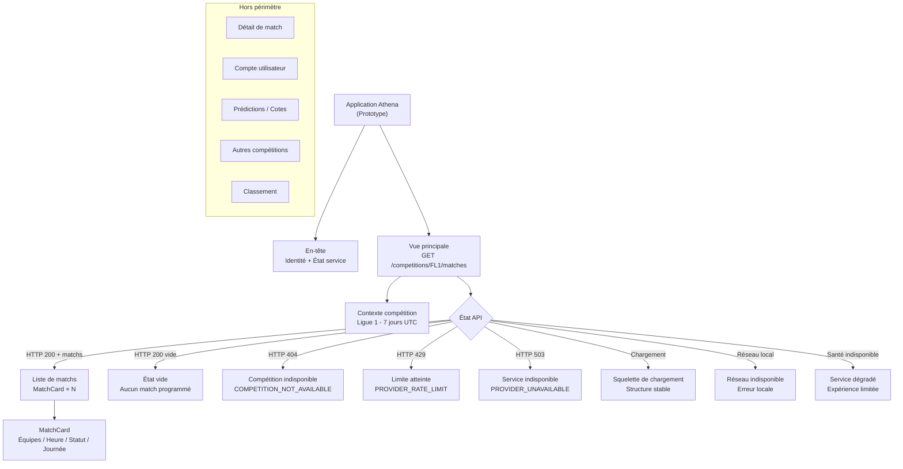

# Phase 3.1 — Architecture de l'information Athena

* **Date :** 2026-08-06
* **Responsable :** Fondateur ABYSS
* **Statut :** Spécification proposée pour validation
* **Référence :** `d39757f5bb6aeb74d8dea58fd7633a5c5e49544e`

---

## 1. Objectif

L'architecture de l'information du prototype Athena organise les données disponibles de manière à ce que l'utilisateur puisse :

- **trouver** les matchs de la compétition `FL1` sans effort ;
- **comprendre** immédiatement l'état du service et de la liste ;
- **agir** face aux états alternatifs (vide, erreur) sans confusion ;
- **ne jamais chercher** des fonctionnalités qui n'existent pas encore.

Cette architecture est strictement limitée aux capacités du backend Athena documentées dans `docs/03-technical-architecture/technical-architecture-overview.md` et `docs/03-technical-architecture/phase-2-closure-report.md`.

---

## 2. Zones conceptuelles de l'interface

L'interface du prototype est organisée en sept zones conceptuelles. Ces zones ne constituent pas des pages séparées ; elles correspondent à des régions structurelles d'une vue principale unique.

| Zone | Rôle | Contenu |
|---|---|---|
| **1. En-tête de l'application** | Identité et navigation globale | Nom ou logotype Athena, indicateur d'état du service |
| **2. Identité Athena** | Marque et positionnement | Nom, version ou prototype label |
| **3. État discret du service** | Feedback passif | Indicateur visuel non intrusif (service opérationnel / dégradé) |
| **4. Contexte de compétition** | Orientation de l'utilisateur | Nom de la compétition (`Ligue 1`), période couverte (7 jours UTC) |
| **5. Contenu principal** | Données de matchs | Liste de cartes de matchs ou état alternatif |
| **6. Zone de feedback** | Communication des états | Chargement, vide, erreur, warning |
| **7. Informations secondaires** | Métadonnées utiles et non intrusives | Source des données (optionnel), heure de dernière mise à jour si disponible |

---

## 3. Vue principale

La vue principale est l'unique vue du prototype. Elle est accessible directement à l'ouverture de l'application.

### Contenu de la vue principale

```text
┌──────────────────────────────────────────────────────┐
│ En-tête : Athena                  [État du service]  │
├──────────────────────────────────────────────────────┤
│ Compétition : Ligue 1 (FL1)       Période : 7 jours  │
├──────────────────────────────────────────────────────┤
│                                                      │
│  [Zone principale : liste de matchs]                 │
│  ou [État de chargement]                             │
│  ou [État vide]                                      │
│  ou [État d'erreur]                                  │
│                                                      │
├──────────────────────────────────────────────────────┤
│ Informations secondaires (optionnel)                 │
└──────────────────────────────────────────────────────┘
```

### Données affichées par match

Les données affichées correspondent strictement aux champs disponibles dans la réponse `GET /competitions/:code/matches` :

| Champ | Disponible | Affiché |
|---|---|---|
| Équipe domicile | ✅ | Oui |
| Équipe extérieure | ✅ | Oui |
| Date et heure UTC | ✅ | Oui |
| Statut (`SCHEDULED`) | ✅ | Oui |
| Journée / Round | ✅ si disponible | Oui si présent |
| Score | Hors périmètre `SCHEDULED` | Non pour les matchs `SCHEDULED` |
| Cote | ❌ Non disponible | Non |
| Prédiction | ❌ Non disponible | Non |
| Détail de match | ❌ Non implémenté | Non |

---

## 4. Éléments absents de l'architecture

Les éléments suivants ne font pas partie de l'architecture de l'information du prototype et ne doivent pas être inclus dans les wireframes ou composants :

```text
Menu de navigation compte / profil
Tableau de bord Premium ou offres
Page de pari ou de prédiction
Page de cotes
Page de détail de match
Classement de compétition
Statistiques historiques
Sélecteur promettant plusieurs compétitions réelles simultanées
Barre de recherche globale (aucun endpoint de recherche disponible)
Notifications push
Favoris persistants
```

---

## 5. Navigation

### Principe de navigation minimale

Compte tenu du périmètre actuel (une seule vue principale, une seule compétition active), la navigation du prototype est **minimaliste par nécessité**. Créer une navigation multi-pages pour des fonctions inexistantes violerait le principe d'honnêteté envers l'utilisateur.

### Navigation autorisée

| Type | Contenu | Justification |
|---|---|---|
| En-tête simple | Identité Athena + état service | Présent sur toute l'interface |
| Aucune barre latérale complexe | Non applicable | Insuffisance de fonctionnalités pour la justifier |
| Aucun onglet de compétition | Non applicable | `FL1` est la seule compétition réelle active (OQ-006 conditionnelle) |

> **Note architecturale :** Le Blueprint `docs/08-product-blueprint/07-navigation.md` décrit une navigation complète (Dashboard, Live, Prédictions, etc.) prévue pour le produit final. Cette navigation n'est **pas applicable au prototype** dont les endpoints sont strictement `GET /health` et `GET /competitions/:code/matches`.

### Navigation future (à cadrer lors de phases ultérieures)

Une fois que des fonctionnalités supplémentaires seront implémentées, la navigation pourra être étendue conformément au Blueprint. Ce cadrage est hors périmètre Phase 3.1.

---

## 6. Hiérarchie de l'information

L'ordre de priorité de l'information dans la vue principale est défini comme suit :

| Priorité | Information | Raison |
|---|---|---|
| **1** | État global du service | Sans service opérationnel, aucune autre information n'a de sens |
| **2** | Compétition et période | Donne le contexte nécessaire à l'interprétation des matchs |
| **3** | Date et heure | Permet à l'utilisateur de situer le match dans le temps |
| **4** | Équipes | Contenu principal de l'intérêt utilisateur |
| **5** | Statut du match | Confirme que le match est programmé |
| **6** | Feedback ou erreur | Communique les états alternatifs |
| **7** | Métadonnées secondaires | Informations complémentaires non critiques |

---

## 7. Responsive — Références de travail

Les trois références de travail suivantes sont utilisées dans les wireframes. Elles représentent des **points de rupture conceptuels** pour l'organisation de l'information, pas des breakpoints de code.

| Référence | Largeur | Usage |
|---|---|---|
| **Compact** | 360 px | Priorité absolue — conception mobile-first |
| **Intermédiaire** | 768 px | Adaptation progressive — tablette |
| **Large** | 1280 px | Extension desktop — contenu élargi |

### Comportement responsive par zone

| Zone | Compact (360 px) | Large (1280 px) |
|---|---|---|
| En-tête | Compact, identité + état en ligne | En-tête pleine largeur |
| Contexte compétition | Affiché sous l'en-tête | Intégré dans un bandeau contextuel |
| Liste de matchs | Cartes empilées, pleine largeur | Cartes en grille (1-2-3 colonnes selon contexte) |
| Feedback / erreurs | Bannière pleine largeur | Bannière ou inset selon la gravité |
| Informations secondaires | Discret ou masqué si peu d'espace | Visible dans le pied de la section |

---

## 8. Accessibilité structurelle

L'architecture de l'information respecte les principes d'accessibilité structurelle suivants, en anticipation de l'implémentation future :

| Principe | Description |
|---|---|
| **Titre principal unique** | Un seul `<h1>` par vue — ex. : « Matchs — Ligue 1 » |
| **Hiérarchie de titres cohérente** | `h1` → `h2` → `h3` sans sauter de niveaux |
| **Régions identifiables** | Régions sémantiques : `<header>`, `<main>`, `<footer>`, `<section>`, `<nav>` |
| **Ordre de lecture logique** | L'ordre du DOM correspond à l'ordre visuel de lecture |
| **Contenu compréhensible sans couleur** | Toute information transmise par couleur est doublée par un texte ou une forme |
| **Navigation clavier future** | Toutes les zones interactives seront accessibles au clavier |
| **Focus visible futur** | Les indicateurs de focus seront visibles et conformes aux critères WCAG 2.1 AA |
| **Annonces accessibles** | Les changements d'état (chargement → données, erreur) seront annoncés via des régions `aria-live` |

---

## 9. Diagramme de l'architecture de l'information



---

```text
ARCHITECTURE DE L'INFORMATION PHASE 3.1 SPÉCIFIÉE — NAVIGATION MINIMALE ET PÉRIMÈTRE RÉEL PRÉSERVÉS
```

---

> Made in Abyss : Spark by the King
