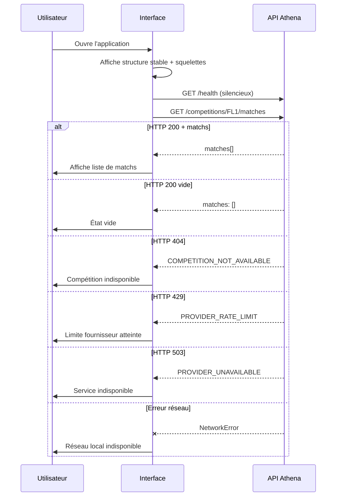
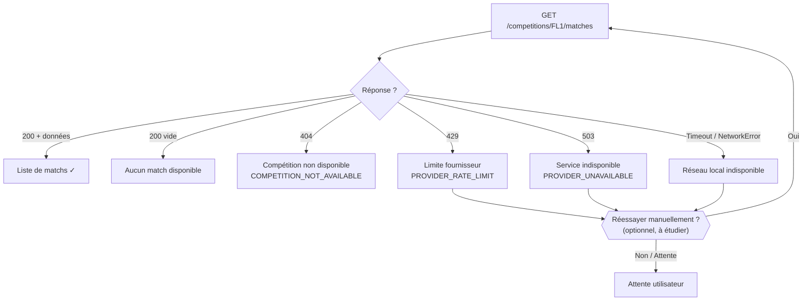

# Phase 3.1 — Parcours utilisateur et états d'interface Athena

* **Date :** 2026-08-06
* **Responsable :** Fondateur ABYSS
* **Statut :** Spécification proposée pour validation
* **Référence :** `d39757f5bb6aeb74d8dea58fd7633a5c5e49544e`

---

## 1. Parcours principal

Le parcours conceptuel unique du prototype suit la séquence suivante :

```text
Ouverture de l'application
→ Rendu de la structure stable (en-tête + squelette)
→ Appel GET /health (vérification silencieuse en arrière-plan)
→ Appel GET /competitions/FL1/matches
→ Affichage de la liste de matchs
   OU état vide (HTTP 200, matches: [])
   OU état d'erreur (HTTP 404 / 429 / 503)
   OU état dégradé (service de santé ou réseau indisponible)
```

> **Important :** La vérification de santé `GET /health` ne nécessite pas d'interaction utilisateur obligatoire. Elle s'effectue en arrière-plan et n'est rendue visible que si elle indique un état dégradé.

---

## 2. États d'interface

### Vue d'ensemble des états

| État | Déclencheur API | Code/Signal | Priorité de communication |
|---|---|---|---|
| Chargement initial | Requête en cours | — | Haute |
| Liste de matchs | HTTP 200 + données | `matches.length > 0` | Normale |
| Aucun match | HTTP 200 vide | `matches: []` | Normale |
| Compétition indisponible | HTTP 404 | `COMPETITION_NOT_AVAILABLE` | Haute |
| Limite fournisseur | HTTP 429 | `PROVIDER_RATE_LIMIT` | Haute |
| Fournisseur indisponible | HTTP 503 | `PROVIDER_UNAVAILABLE` | Haute |
| Réseau local indisponible | Erreur réseau locale | `NetworkError / TypeError` | Haute |
| Service de santé indisponible | `/health` dégradé | Statut non-200 | Modérée |

---

### État 1 — Chargement initial

**Déclencheur :** Ouverture de l'application, requête `GET /competitions/FL1/matches` en cours.

**Objectif utilisateur :** Comprendre que l'application est active et charge les données.

| Attribut | Spécification |
|---|---|
| Structure | Stable dès l'affichage — aucun layout shift |
| Indicateur | Squelettes de cartes (skeleton) représentant la forme des MatchCards |
| Message | Aucun texte de chargement obligatoire — les squelettes suffisent |
| Durée maximale recommandée | À définir lors de l'implémentation — timeout à documenter |
| Faux contenu | Interdit — aucune donnée fictive ne doit apparaître |
| Action possible | Aucune — attente passive |
| Action interdite | Bouton de rechargement manuel pendant le chargement initial |

**Comportement accessible :**
- Une région `aria-live="polite"` annonce la disponibilité des données une fois chargées.
- Les squelettes utilisent `aria-hidden="true"` ou un label `aria-label="Chargement en cours"`.

**Comportement responsive :**
- **360 px :** Une colonne de squelettes de cartes, pleine largeur.
- **768 px :** Une colonne légèrement plus large.
- **1280 px :** Deux ou trois colonnes de squelettes selon la grille.

---

### État 2 — HTTP 200 avec matchs

**Déclencheur :** Réponse `GET /competitions/FL1/matches` avec `matches.length > 0`.

**Objectif utilisateur :** Lire et comprendre les matchs programmés.

| Attribut | Spécification |
|---|---|
| Contenu | Liste de MatchCards |
| Données par card | Équipes domicile/extérieure, date/heure UTC, statut `SCHEDULED`, journée |
| Ordre | Chronologique par date/heure UTC (du plus proche au plus éloigné) |
| Aucune donnée inventée | Interdit — seuls les champs de la réponse API sont affichés |
| Lien vers détail | Interdit — `getMatchDetails()` non implémentée |
| Score | Absent pour les matchs `SCHEDULED` |
| Cote / Prédiction | Absente |

**Comportement accessible :**
- Chaque MatchCard est une liste structurée avec un niveau de titre approprié.
- Les heures sont affichées en format lisible (non pas uniquement ISO 8601).
- Une région annonce le nombre de matchs disponibles.

**Comportement responsive :**
- **360 px :** Cartes empilées, pleine largeur.
- **768 px :** Cartes plus larges, infos en ligne si espace suffisant.
- **1280 px :** Grille de 2-3 colonnes ou liste large.

---

### État 3 — HTTP 200 avec tableau vide

**Déclencheur :** Réponse `GET /competitions/FL1/matches` avec `matches: []`.

**Objectif utilisateur :** Comprendre qu'il n'y a pas de match disponible, sans penser à une erreur.

| Attribut | Spécification |
|---|---|
| Message conceptuel | « Aucun match programmé sur la période disponible. » |
| Ton | Neutre, informatif — pas alarmiste |
| Icône ou illustration | Facultative, documentaire uniquement |
| Action possible | Aucune — aucun rechargement automatique proposé |
| À ne pas présenter | Comme une erreur système |

**Comportement accessible :**
- Annonce via `aria-live` : « Aucun match disponible pour la période. »

---

### État 4 — HTTP 404 COMPETITION_NOT_AVAILABLE

**Déclencheur :** Le serveur retourne `HTTP 404` avec le code `COMPETITION_NOT_AVAILABLE`.

**Objectif utilisateur :** Comprendre que la compétition demandée n'est pas disponible dans le prototype.

| Attribut | Spécification |
|---|---|
| Message conceptuel | « Cette compétition n'est pas disponible. Seule la Ligue 1 (FL1) est prise en charge par le prototype. » |
| Ton | Informatif, non alarmiste |
| Code technique exposé | `COMPETITION_NOT_AVAILABLE` — non affiché à l'utilisateur |
| Action possible | Aucune suggestion de compétition alternative (non disponibles) |
| Action interdite | Sélecteur de compétitions non supportées |

**Comportement accessible :**
- Annonce via `aria-live="assertive"` pour informer immédiatement.
- Message d'erreur lié au contenu par `role="alert"`.

---

### État 5 — HTTP 429 PROVIDER_RATE_LIMIT

**Déclencheur :** Le serveur retourne `HTTP 429` avec le code `PROVIDER_RATE_LIMIT`.

**Objectif utilisateur :** Comprendre que les données ne peuvent pas être actualisées immédiatement en raison des limites du fournisseur externe.

| Attribut | Spécification |
|---|---|
| Message conceptuel | « Les données ne peuvent pas être actualisées pour l'instant. Veuillez réessayer dans quelques instants. » |
| Ton | Transparent, sans alarmisme |
| Retry automatique | Non proposé dans la spécification — toute logique de retry est backend uniquement |
| Action possible | Action manuelle de nouvelle tentative peut être étudiée (non décidée) |
| Exposition de la limite | Le quota exact du fournisseur n'est pas exposé à l'utilisateur |

**Comportement accessible :**
- Message communiqué via `role="alert"`.

> **Note :** Aucun retry automatique côté interface ne doit être documenté ou proposé. Cette logique appartient exclusivement au backend.

---

### État 6 — HTTP 503 PROVIDER_UNAVAILABLE

**Déclencheur :** Le serveur retourne `HTTP 503` avec le code `PROVIDER_UNAVAILABLE`.

**Objectif utilisateur :** Comprendre que le service est temporairement indisponible.

| Attribut | Spécification |
|---|---|
| Message conceptuel | « Le service est temporairement indisponible. Veuillez recharger plus tard. » |
| Ton | Transparent, rassurant sur le caractère temporaire |
| Action manuelle possible | Un bouton « Réessayer » peut être **étudié** comme comportement d'interface |
| Distinction retry manuel / backend | **Obligatoire** — le bouton « Réessayer » déclenche une nouvelle requête utilisateur, pas un retry automatique backend |
| Retry automatique | Non proposé |

**Comportement accessible :**
- Message via `role="alert"`.
- Le bouton « Réessayer » (si présent) est accessible au clavier et a un label explicite.

---

### État 7 — Réseau local indisponible

**Déclencheur :** Erreur réseau locale (ex. : `NetworkError`, `TypeError: Failed to fetch`) — distinct d'une réponse HTTP 503.

**Objectif utilisateur :** Comprendre que le problème est local (connexion internet) et non lié au service Athena.

| Attribut | Spécification |
|---|---|
| Message conceptuel | « Connexion indisponible. Vérifiez votre connexion internet et réessayez. » |
| Ton | Pratique, orienté vers l'action |
| Distinction avec HTTP 503 | Explicitement différencié dans le message et l'iconographie |
| Action possible | Invitation à vérifier la connexion + bouton « Réessayer » |

**Comportement accessible :**
- `role="alert"` pour communication immédiate.
- Focus géré vers le message ou le bouton d'action.

---

### État 8 — Service de santé indisponible

**Déclencheur :** `GET /health` retourne un statut non-200 ou ne répond pas.

**Objectif utilisateur :** Comprendre que le service Athena est en état dégradé, sans alarmisme excessif.

| Attribut | Spécification |
|---|---|
| Message conceptuel | « Le service Athena est en cours de maintenance ou rencontre une difficulté technique. » |
| Ton | Non alarmiste — expérience dégradée claire |
| Affichage | Indicateur discret dans l'en-tête ou bannière modérée |
| Action possible | Aucune action automatique — invitation à reparamétrer plus tard |

---

## 3. Matrice API → Interface

| Réponse API | État d'interface | Titre conceptuel | Message conceptuel | Action proposée | Annonce accessible | Journalisation interface |
|---|---|---|---|---|---|---|
| Requête en cours | Chargement | — | — (squelettes) | Aucune | « Chargement en cours » | Durée de requête (pas de payload) |
| HTTP 200 + données | Liste de matchs | « Matchs — Ligue 1 » | Nombre de matchs | Aucune (lecture) | « N matchs disponibles » | Nombre de résultats |
| HTTP 200 vide | Aucun match | « Aucun match disponible » | « Aucun match programmé sur la période. » | Aucune | « Aucun match disponible » | Code 200 + count 0 |
| HTTP 404 `COMPETITION_NOT_AVAILABLE` | Compétition indisponible | « Compétition non disponible » | « Seule la Ligue 1 FL1 est prise en charge. » | Aucune | « Erreur : compétition non disponible » | Code 404 uniquement |
| HTTP 429 `PROVIDER_RATE_LIMIT` | Limite atteinte | « Données temporairement inaccessibles » | « Réessayez dans quelques instants. » | Réessayer (manuel, optionnel) | « Avertissement : limite de requêtes atteinte » | Code 429 uniquement |
| HTTP 503 `PROVIDER_UNAVAILABLE` | Service indisponible | « Service indisponible » | « Service temporairement indisponible. » | Réessayer (manuel, à étudier) | « Erreur : service indisponible » | Code 503 uniquement |
| Erreur réseau locale | Réseau indisponible | « Connexion indisponible » | « Vérifiez votre connexion internet. » | Réessayer (après reconnexion) | « Erreur : connexion réseau indisponible » | Erreur locale (type uniquement) |
| GET /health dégradé | Service dégradé | « Service en maintenance » | « Athena rencontre une difficulté technique. » | Aucune | « Information : service dégradé » | Status /health uniquement |

> **Règle de journalisation :** La colonne journalisation côté interface **interdit** l'exposition de secrets, headers d'authentification, tokens API, payloads bruts ou réponses JSON complètes. Seuls les codes HTTP et les compteurs agrégés sont journalisables.

---

## 4. Diagrammes

### 4.1 Parcours principal



### 4.2 Branches d'erreur



### 4.3 Table des transitions d'état

| De | Vers | Condition |
|---|---|---|
| Chargement | Liste de matchs | HTTP 200 + `matches.length > 0` |
| Chargement | Aucun match | HTTP 200 + `matches: []` |
| Chargement | Compétition indisponible | HTTP 404 |
| Chargement | Limite fournisseur | HTTP 429 |
| Chargement | Service indisponible | HTTP 503 |
| Chargement | Réseau indisponible | NetworkError |
| Tout état | Chargement | Nouvelle requête déclenchée |

---

## 5. Aucun mécanisme inventé

La présente spécification **ne documente pas et n'autorise pas** les mécanismes suivants :

```text
Polling automatique (aucun intervalle de rafraîchissement automatique)
Retry automatique côté interface (la logique de retry est exclusivement backend)
Cache navigateur persistant (aucune stratégie de cache côté client décidée)
Notifications push (aucun service de notification dans le prototype)
Compte utilisateur ou session (aucune authentification)
Historique persistant (cache mémoire backend TTL 10 min uniquement)
Personnalisation basée sur un profil (aucun profil disponible)
Gestion des favoris (non disponible)
```

---

```text
PARCOURS ET ÉTATS PHASE 3.1 SPÉCIFIÉS — CONTRATS API REPRÉSENTÉS SANS EXTENSION FONCTIONNELLE
```

---

> Made in Abyss : Spark by the King
